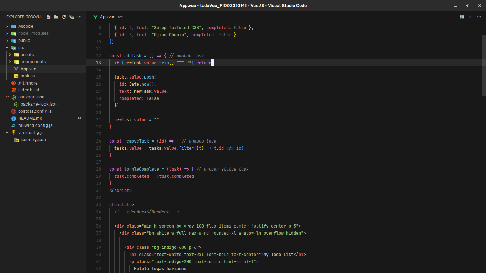
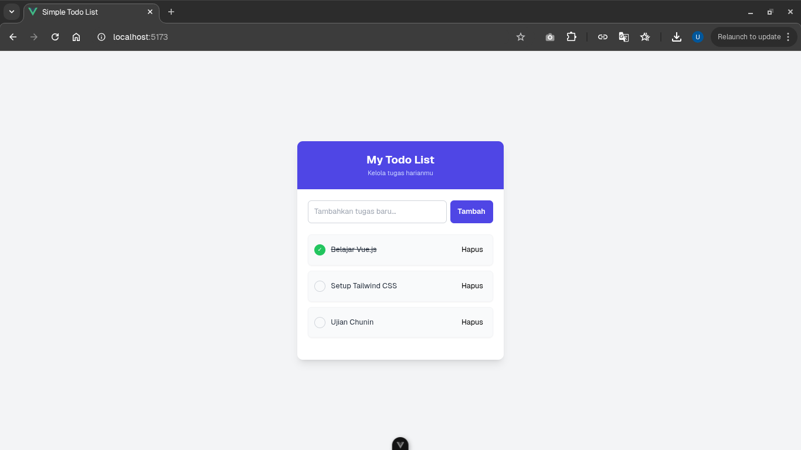
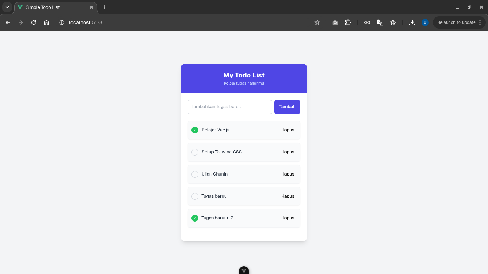
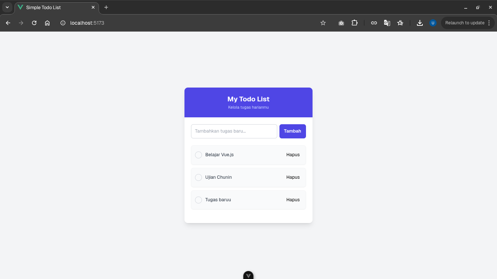
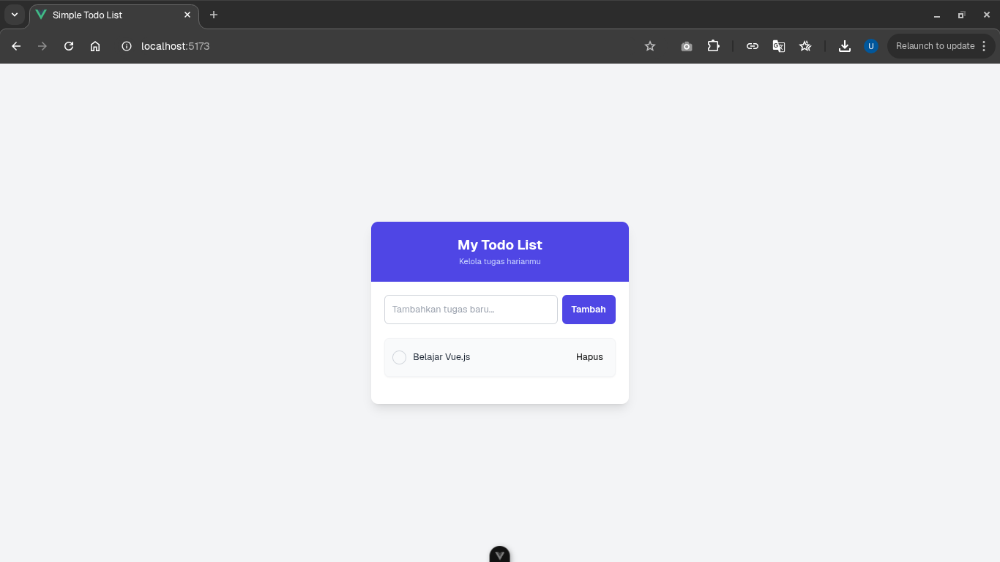
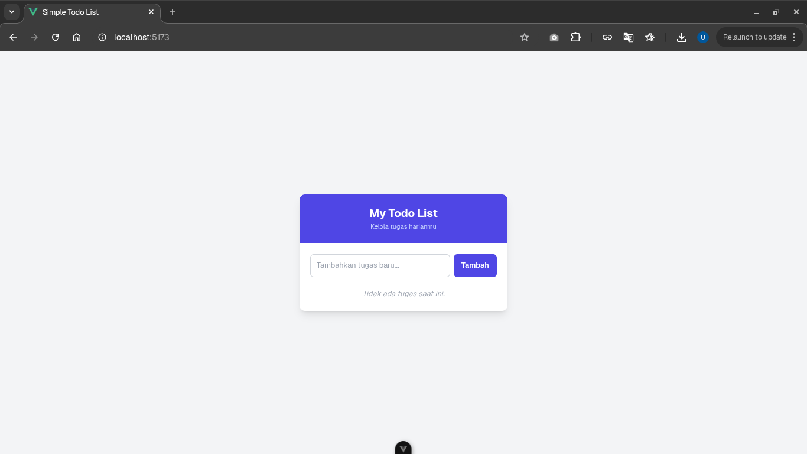

# Assignment: Vue.js – Simple To-Do List

## Identitas
> Nama : UMAM ALPARIZI </br>
> NIM : F1D02310141

---

## Deskripsi Tugas

Pada tugas ini saya membuat aplikasi To-Do List sederhana menggunakan Vue.js dengan styling Tailwind CSS. Aplikasi ini bisa membantu pengguna mengelola tugas harian mereka dengan antarmuka yang bersih dan responsif.

Aplikasi memiliki fitur utama sebagai berikut:
- Menambah tugas baru melalui form input yang responsif
- Menghapus tugas yang sudah tidak diperlukan dengan tombol hapus
- Menandai tugas sebagai selesai atau belum selesai dengan sistem toggle
- Menampilkan pesan informatif ketika daftar tugas kosong
- Menggunakan sistem reaktifitas Vue.js dengan Composition API dan `ref()`
- Styling sederhana tapi modern menggunakan Tailwind CSS dengan desain yang user-friendly

---

## Hasil

### 1. Screenshot Kode dan Hasil Program
- Kode program
  

- Run di browser
  

- Tambah tugas baru
  

- Tandai tugas selesai
  

- Kembalikan tugas menjadi belum
  

- Hapus tugas
  

- Tidak ada tugas
  

### 2. Fitur Aplikasi

Aplikasi Todo List ini memiliki beberapa fitur utama yang telah diimplementasi:

**Antarmuka Pengguna:**
- Header dengan judul "My Todo List" dan subtitle "Kelola tugas harianmu"
- Form input untuk menambahkan tugas baru dengan placeholder yang jelas
- Daftar tugas yang ditampilkan dalam format card dengan styling yang menarik
- Tombol aksi untuk setiap tugas (toggle complete dan hapus)

**Fungsionalitas:**
- Penambahan tugas baru melalui form dengan validasi input kosong
- Penghapusan tugas individual dengan konfirmasi visual
- Toggle status completed/incomplete dengan indikator visual checkmark
- Tampilan kondisional ketika tidak ada tugas (empty state)

**Styling dan UX:**
- Desain responsif yang bekerja di berbagai ukuran layar
- Warna tema indigo yang konsisten dan profesional
- Hover effects dan transisi yang smooth untuk interaksi yang lebih baik
- Typography yang jelas dan mudah dibaca

### 3. Penjelasan Teknis

**Fungsi `addTask()`:**
Fungsi ini bertanggung jawab untuk menambahkan tugas baru ke dalam daftar. Pertama, fungsi melakukan validasi dengan memeriksa apakah input tidak kosong menggunakan `newTask.value.trim() === ""`. Jika input valid, fungsi membuat objek tugas baru dengan struktur yang terdiri dari id unik menggunakan `Date.now()`, teks tugas dari input pengguna, dan status completed yang diset false secara default. Setelah tugas ditambahkan ke array `tasks.value` menggunakan method `push()`, input field dikosongkan kembali untuk persiapan input berikutnya.

**Rendering Data dengan `v-for`:**
Daftar tugas ditampilkan menggunakan direktif `v-for="task in tasks"` yang melakukan iterasi pada array tasks. Setiap item tugas dirender sebagai elemen `<li>` dengan key unik menggunakan `:key="task.id"` untuk optimasi rendering Vue.js. Di dalam setiap item, terdapat struktur yang menampilkan checkbox visual, teks tugas, dan tombol hapus. Penggunaan `v-for` memungkinkan daftar tugas untuk secara otomatis update ketika data berubah berkat sistem reaktifitas Vue.js.

**Sistem Toggle dan Hapus:**
Tombol toggle bekerja melalui fungsi `toggleComplete(task)` yang mengubah status `task.completed` dengan operasi negasi boolean. Perubahan ini langsung tercermin pada UI melalui class binding kondisional yang mengubah styling teks menjadi strikethrough dan warna abu-abu untuk tugas yang completed. Fungsi `removeTask(id)` menggunakan method `filter()` untuk membuat array baru yang tidak mengandung tugas dengan id yang sesuai, sehingga secara efektif menghapus tugas dari daftar.

**Reactive State Management:**
Aplikasi menggunakan Composition API dengan `ref()` untuk membuat reactive references. Variable `newTask` menyimpan nilai input form, sedangkan `tasks` menyimpan array semua tugas. Penggunaan `ref()` memastikan bahwa setiap perubahan pada data akan secara otomatis memicu re-render komponen yang relevan, menciptakan pengalaman pengguna yang responsif dan real-time.

---

## Setup dan Instalasi

### Prasyarat
- Node.js versi 20.19.0 atau 22.12.0 ke atas
- npm atau yarn package manager

### Instalasi Proyek

```bash
# Clone atau download proyek
git clone https://github.com/gper00/week12-vue-todo-list.git

# Masuk ke direktori proyek
cd week12-vue-todo-list.git

# Install dependencies
npm install
```

### Menjalankan Aplikasi

```bash
# Development server dengan hot-reload
npm run dev

# Build untuk production
npm run build

# Preview build production
npm run preview
```

### Struktur Proyek

```
todoVue_F1D02310141/
├── src/
│   ├── components/
│   │   └── Header.vue
│   ├── assets/
│   │   └── main.css
│   ├── App.vue
│   └── main.js
├── public/
├── index.html
├── package.json
├── vite.config.js
├── tailwind.config.js
└── README.md
```

### Teknologi yang Digunakan

- Vue.js 3.5.22 - Progressive JavaScript framework
- Vite 7.1.11 - Next generation frontend tooling
- Tailwind CSS 3.4.18 - Utility-first CSS framework
- PostCSS 8.5.6 - CSS post-processor
- Autoprefixer 10.4.22 - CSS vendor prefixing

---
